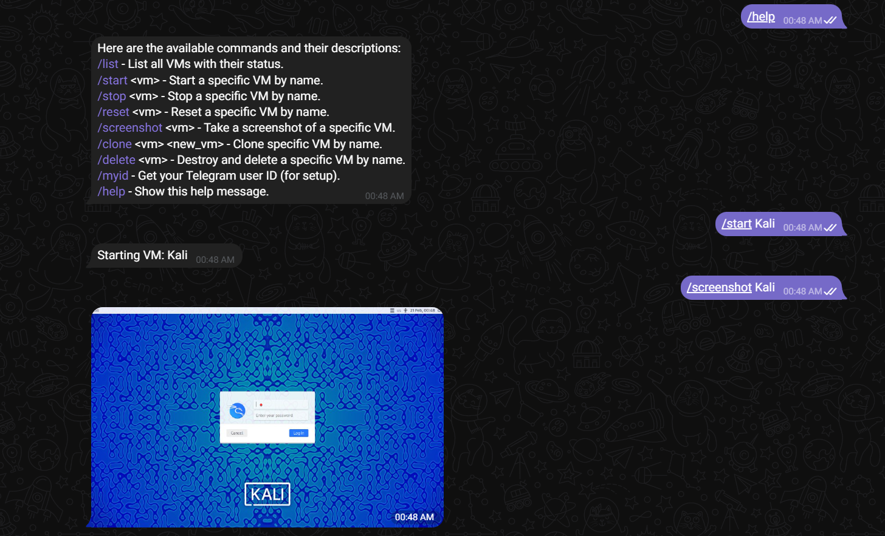

# ESXi Telegram Bot

A Telegram bot designed to interact with an ESXi server, allowing authorized users to manage virtual machines (VMs) with commands such as listing, starting, stopping, resetting, cloning, deleting, and taking screenshots.



## Features
- **List VMs**: Get a list of all VMs with their current status.
- **Start, Stop, and Reset VMs**: Easily manage VM power states.
- **Clone VM**: Create a new VM by cloning an existing one with dynamic datastore selection.
- **Delete VM**: Unregister and completely remove a VM along with its storage.
- **Take VM Screenshots**: Capture and send screenshots of VMs directly through Telegram.
- **User-based Permission System**: Control access to commands for specific users.

## Prerequisites
- Docker and Docker Compose installed on your system.
- A Telegram bot token obtained from [BotFather](https://core.telegram.org/bots#botfather).
- ESXi server credentials and user permissions configured.

## Installation

### 1. Clone the Repository
```bash
git clone 
cd esxi-telegram-bot
```

### 2. Set Up the Environment Variables
Edit the `.env` file in the project:
```env
TELEGRAM_BOT_TOKEN=your-telegram-bot-token
ESXI_HOST=your-esxi-host
ESXI_USER=your-esxi-user
ESXI_PASSWORD=your-esxi-password
USER_PERMISSIONS={"XXXXXXXX": ["list", "start", "stop", "reset", "screenshot"]}
```
- Replace `XXXXXXXX` with the actual Telegram user IDs.
- Adjust permissions for each user as needed.


### 5. Build and Run the Container
```bash
docker-compose up -d --build
```

## Usage
Start interacting with your bot in Telegram and use the following commands:
- `/list` - List all VMs with their status.
- `/start <vm>` - Start a specific VM by name.
- `/stop <vm>` - Stop a specific VM by name.
- `/reset <vm>` - Reset a specific VM by name.
- `/screenshot <vm>` - Take a screenshot of a specific VM.
- `/clone <vm> <new_vm>` - Clone specific VM by name.
- `/delete <vm>` - Destroy and delete a specific VM by name.
- `/help` - Show the list of available commands and their descriptions.
- `/myid` - Get your Telegram user ID (for setup).

## Security Notes
- Ensure the Telegram bot token and ESXi credentials are kept secure.
- Limit bot access to trusted users using the user permission system.

## Troubleshooting
- **Container logs**: Use `docker logs telegram-bot` to check logs.
- **Permissions**: Ensure the ESXi user account has sufficient permissions for VM management tasks.
- **SSL Warnings**: If you encounter SSL warnings, these are disabled in the code for convenience when dealing with self-signed certificates.


## Copyright
© 2024 Mohammed Aladwani. All rights reserved.

## License

This project is licensed under the MIT License.

```
MIT License

Copyright (c) [2024] [Mohmammed Aladwani]

Permission is hereby granted, free of charge, to any person obtaining a copy
of this software and associated documentation files (the "Software"), to deal
in the Software without restriction, including without limitation the rights
to use, copy, modify, merge, publish, distribute, sublicense, and/or sell
copies of the Software, and to permit persons to whom the Software is
furnished to do so, subject to the following conditions:

The above copyright notice and this permission notice shall be included in all
copies or substantial portions of the Software.

THE SOFTWARE IS PROVIDED "AS IS", WITHOUT WARRANTY OF ANY KIND, EXPRESS OR
IMPLIED, INCLUDING BUT NOT LIMITED TO THE WARRANTIES OF MERCHANTABILITY,
FITNESS FOR A PARTICULAR PURPOSE AND NONINFRINGEMENT. IN NO EVENT SHALL THE
AUTHORS OR COPYRIGHT HOLDERS BE LIABLE FOR ANY CLAIM, DAMAGES OR OTHER
LIABILITY, WHETHER IN AN ACTION OF CONTRACT, TORT OR OTHERWISE, ARISING FROM,
OUT OF OR IN CONNECTION WITH THE SOFTWARE OR THE USE OR OTHER DEALINGS IN THE
SOFTWARE.
```

For more information, see the [MIT License](https://opensource.org/licenses/MIT).

